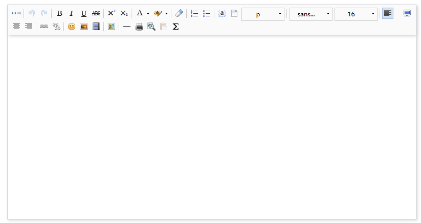

# 百度编辑器 uEditor for Yii2



## 使用方法

> 下载验证码包

```

composer require dungang/geetest

```

> 配置编辑器模块 config/web.php


```

'ueditor'=>[
    'class'=>'dungang\ueditor\Module',
//            'config'=>[
//                "imageUrlPrefix"=> 'basePath',//(可选)图片访问路径前缀
//                "imagePathFormat" => "/upload/image/{yyyy}{mm}{dd}/{time}{rand:6}", //(可选)上传保存路径
//                "imageManagerUrlPrefix"=> 'basePath',//(可选)
//                "fileManagerUrlPrefix"=> 'basePath',//(可选)文件管理路径前缀
//            ]
],
    
```

> 配置widget

```

<?= $form->field($model, 'intro')->widget(\dungang\ueditor\widgets\Editor::className(),[
    //（可选）增加编辑器按钮，1维数组（之支持一行显示，没有必要多行显示），官方是二维数组（多行工具）
    'toolBars'=>[
        'forecolor', 'backcolor', '|' ,'insertimage', 
    ]
]) ?>

```

> ToolBar Options

所有的按钮选项

```

'fullscreen', 'source', '|', 'undo', 'redo', '|',
'bold', 'italic', 'underline', 'fontborder', 'strikethrough', 'superscript', 'subscript', 'removeformat', 'formatmatch', 'autotypeset', 'blockquote', 'pasteplain', '|', 'forecolor', 'backcolor', 'insertorderedlist', 'insertunorderedlist', 'selectall', 'cleardoc', '|',
'rowspacingtop', 'rowspacingbottom', 'lineheight', '|',
'customstyle', 'paragraph', 'fontfamily', 'fontsize', '|',
'directionalityltr', 'directionalityrtl', 'indent', '|',
'justifyleft', 'justifycenter', 'justifyright', 'justifyjustify', '|', 'touppercase', 'tolowercase', '|',
'link', 'unlink', 'anchor', '|', 'imagenone', 'imageleft', 'imageright', 'imagecenter', '|',
'simpleupload', 'insertimage', 'emotion', 'scrawl', 'insertvideo', 'music', 'attachment', 'map', 'gmap', 'insertframe', 'insertcode', 'webapp', 'pagebreak', 'template', 'background', '|',
'horizontal', 'date', 'time', 'spechars', 'snapscreen', 'wordimage', '|',
'inserttable', 'deletetable', 'insertparagraphbeforetable', 'insertrow', 'deleterow', 'insertcol', 'deletecol', 'mergecells', 'mergeright', 'mergedown', 'splittocells', 'splittorows', 'splittocols', 'charts', '|',
'print', 'preview', 'searchreplace', 'drafts', 'help'
            
```

> 默认按钮选项

```
'fullscreen', 'source', 'undo', 'redo', '|',
'fontsize',
'bold', 'italic', 'underline', 'fontborder', 'strikethrough', 'removeformat',
'formatmatch', 'autotypeset', 'blockquote', 'pasteplain', '|',
'forecolor', 'backcolor', '|',
'lineheight', '|',
'indent', '|',
            
```

> 按钮选项说明

'anchor':'锚点', 'undo':'撤销', 'redo':'重做', 'bold':'加粗', 'indent':'首行缩进', 'snapscreen':'截图',

'italic':'斜体', 'underline':'下划线', 'strikethrough':'删除线', 'subscript':'下标','fontborder':'字符边框',

'superscript':'上标', 'formatmatch':'格式刷', 'source':'源代码', 'blockquote':'引用',

'pasteplain':'纯文本粘贴模式', 'selectall':'全选', 'print':'打印', 'preview':'预览',

'horizontal':'分隔线', 'removeformat':'清除格式', 'time':'时间', 'date':'日期',

'unlink':'取消链接', 'insertrow':'前插入行', 'insertcol':'前插入列', 'mergeright':'右合并单元格', 'mergedown':'下合并单元格',

'deleterow':'删除行', 'deletecol':'删除列', 'splittorows':'拆分成行',

'splittocols':'拆分成列', 'splittocells':'完全拆分单元格','deletecaption':'删除表格标题','inserttitle':'插入标题',

'mergecells':'合并多个单元格', 'deletetable':'删除表格', 'cleardoc':'清空文档','insertparagraphbeforetable':"表格前插入行",'insertcode':'代码语言',

'fontfamily':'字体', 'fontsize':'字号', 'paragraph':'段落格式', 'simpleupload':'单图上传', 'insertimage':'多图上传','edittable':'表格属性','edittd':'单元格属性', 'link':'超链接',

'emotion':'表情', 'spechars':'特殊字符', 'searchreplace':'查询替换', 'map':'Baidu地图', 'gmap':'Google地图',

'insertvideo':'视频', 'help':'帮助', 'justifyleft':'居左对齐', 'justifyright':'居右对齐', 'justifycenter':'居中对齐',

'justifyjustify':'两端对齐', 'forecolor':'字体颜色', 'backcolor':'背景色', 'insertorderedlist':'有序列表',

'insertunorderedlist':'无序列表', 'fullscreen':'全屏', 'directionalityltr':'从左向右输入', 'directionalityrtl':'从右向左输入',

'rowspacingtop':'段前距', 'rowspacingbottom':'段后距',  'pagebreak':'分页', 'insertframe':'插入Iframe', 'imagenone':'默认',

'imageleft':'左浮动', 'imageright':'右浮动', 'attachment':'附件', 'imagecenter':'居中', 'wordimage':'图片转存',

'lineheight':'行间距','edittip' :'编辑提示','customstyle':'自定义标题', 'autotypeset':'自动排版',

'webapp':'百度应用','touppercase':'字母大写', 'tolowercase':'字母小写','background':'背景','template':'模板','scrawl':'涂鸦',

'music':'音乐','inserttable':'插入表格','drafts': '从草稿箱加载', 'charts': '图表'

## 协议

MIT License

Copyright (c) 2017 dungang

Permission is hereby granted, free of charge, to any person obtaining a copy
of this software and associated documentation files (the "Software"), to deal
in the Software without restriction, including without limitation the rights
to use, copy, modify, merge, publish, distribute, sublicense, and/or sell
copies of the Software, and to permit persons to whom the Software is
furnished to do so, subject to the following conditions:

The above copyright notice and this permission notice shall be included in all
copies or substantial portions of the Software.

THE SOFTWARE IS PROVIDED "AS IS", WITHOUT WARRANTY OF ANY KIND, EXPRESS OR
IMPLIED, INCLUDING BUT NOT LIMITED TO THE WARRANTIES OF MERCHANTABILITY,
FITNESS FOR A PARTICULAR PURPOSE AND NONINFRINGEMENT. IN NO EVENT SHALL THE
AUTHORS OR COPYRIGHT HOLDERS BE LIABLE FOR ANY CLAIM, DAMAGES OR OTHER
LIABILITY, WHETHER IN AN ACTION OF CONTRACT, TORT OR OTHERWISE, ARISING FROM,
OUT OF OR IN CONNECTION WITH THE SOFTWARE OR THE USE OR OTHER DEALINGS IN THE
SOFTWARE.
